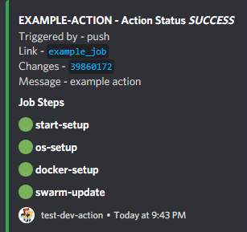

# Discord messages for GitHub Actions with info about workflow, jobs,  commit, changes




## TLDR
Full Example of picture seen.

```yaml
name: example

on:
  push: {branches: main}
  pull_request: {branches: main}

jobs:
  hello_world_job:
    runs-on: ubuntu-latest
    env:
      DISCORD_WEBHOOK_URL: ${{ secrets.DISCORD_WEBHOOK_URL }}
    name: Example job
    steps:
       - name: Checkout
        id: start-setup
        uses: actions/checkout@v2

      - name: os-setup
        uses: vely-digital/discord-action-steps
        id: os-setup
        with:
          status: ${{ job.status }}
          steps: ${{ toJson(steps) }}
        if: always()
      
      - name: docker-setup
        id: docker-setup
        run: echo 'docker-setup'
        
      - name: swarm-update
        id: swarm-update
        run: echo 'swarm-update'

      - name: exit-example
        uses: vely-digital/discord-action-steps 
        id: exit-example
        with:
          status: ${{ job.status }}
          steps: ${{ toJson(steps) }}
        if: always()

```

# Documentation

## *Enviroment Context*

`DISCORD_WEBHOOK_URL` (required)

Create discord webhook and copy it inside of github actions. After that place secret ID inside enviroment table (see below). \n


```yaml
env:
  DISCORD_WEBHOOK_URL: ${{ secrets.DISCORD_WEBHOOK_URL }}
```

To create Discord server webhook go to: Right click on discord server -> server settings -> integration -> webhooks -> new webhook

## *Inputs Parameters*

### `status` (required)

Status parameter takes info from actions API and returns it. It is required. This version only supports github defaults. 

```yaml
with:
  status: ${{ job.status }}
```

### `steps` (required)

Steps parameter takes info about steps from action API. In this version is required and will always show steps info in discord return.

```yaml
with:
  status: ${{ job.status }}
  steps: ${{ toJson(steps) }}
```

**IMPORTANT!!!** For steps to show up in message. Every one needs to have ID see example below. Id name will be shown as name in message.

```yaml
- name: example
  uses: vely-digital/discord-action-steps
  id: example
  with:
    status: ${{ job.status }}
    steps: ${{ toJson(steps) }}
```

## Job status check functions

You can use GitHub actions check functions to ensure you send message about build in all job statuses.

* `success()` (default)
* `always()`
* `cancelled()`
* `failure()`

[Github documentation](https://docs.github.com/en/free-pro-team@latest/actions/reference/context-and-expression-syntax-for-github-actions#job-status-check-functions)

# Resources

* GitHub Actions Toolkit https://github.com/actions/toolkit
* GitHub Actions Starter Workflows https://github.com/actions/starter-workflows
* Webhook-Discord https://github.com/jb3/webhook-discord

# License
Copyright (c) 2020 Filip Leiner. Available under the MIT License.
